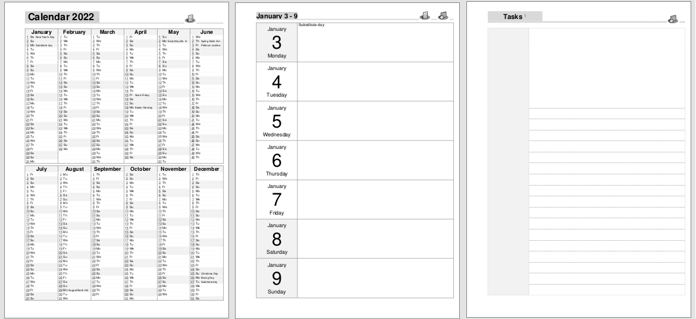

# reMarkable-year-week-tasks-planner
Clickable Year-Week-Tasks PDF planner for the reMarkable Tablet. 

Download the PDF for your reMarkable or the docx to make your own changes.

**Screenshot**

Year and Week sheets sourced from the https://www.calendarpedia.co.uk/ resource.  Merged together, added hyperlinks, bookmarks and cornell(ish) style tasks sheet. Simplified the year view and colours for better e-ink support. Added tab style page headers & clickable calendar & task icons ( ♡ palm os).   

V2 - Flipped Cornell style Task sheets to give a larger space at the top, for working on the current task.

Migrating from previous versions posted can be done by just copying a whole page of writing, and pasting in to newer versions. Spacing will match.
